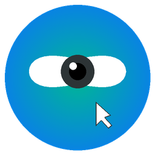

# EyeCursor

<p align="center">
  
</p>

<p align="center">
  <b>Control your mouse cursor with head and eye movements.</b>
</p>

EyeCursor is a cross-platform desktop app for driving the mouse cursor from a webcam. It supports several tracking modes, per-user calibration profiles, and click/scroll gestures based on facial blendshapes (lip pucker, lip tuck, smirks).

This README covers the desktop app under `src/app/`. The top-level repo also contains a `criteria/` test-lab app and a `game/` demo; both share this venv.

---

## Features

- One-camera head pose mode. Turn your head to move the cursor, single webcam.
- Two-camera stereo mode. Stereo depth-enhanced head tracking, two webcams.
- Eye-gaze mode (ETH-XGaze). One webcam, look at the screen to move the cursor.
- Eye-gaze bubble and hybrid bubble-lock modes (registered in `src/app/bootstrap.py`) that mix gaze with head pose.
- Facial gesture clicks and scrolls (see below).
- Per-user profiles with their own calibration data.
- Step-by-step calibration wizards for head pose, facial gestures, stereo geometry, and gaze.
- Camera discovery with previews.
- Stop tracking at any time with Q or Esc from the main window, or the Stop button on the Dashboard.

### Gestures (head-pose modes)

| Gesture | Action |
|---------|--------|
| Pucker lips outward (as if blowing) | Hold LEFT mouse button. Brief tap = click, sustained past ~0.5 s = drag/draw. |
| Tuck lips inward (rolled in or pressed together) | Hold RIGHT mouse button, same click/drag semantics. |
| Smirk LEFT (raise the left corner of the mouth) | Scroll up, speed proportional to intensity. |
| Smirk RIGHT (raise the right corner of the mouth) | Scroll down. |

Pucker uses MediaPipe's `mouthPucker` blendshape. We deliberately don't use `cheekPuff`, which the default MediaPipe model reports unreliably. Lip tuck is `max(mouthRollUpper, mouthRollLower, mouthPressLeft, mouthPressRight)`; smirks are `mouthSmileLeft` and `mouthSmileRight`. Click gestures stay reliable when the head is turned; scroll gestures want a roughly straight-on face.

The cursor is briefly frozen for the first 0.5 s of a smirk and then unfreezes so you can keep dragging while the click is held - this is what makes drawing in paint apps work. A 200 ms intent buffer per scroll direction filters out brief, accidental lip motion.

Thresholds and constants live in `src/face_tracking/controllers/blendshape_gesture_constants.py`; the controller is `src/face_tracking/controllers/gesture.py`.

---

## Supported platforms

| Platform | Status |
|---|---|
| Linux | Works |
| Windows | Works |
| macOS | Works, needs the `pyobjc-*` extras in `requirements.txt` |

Python 3.11 or 3.12 is required. `dlib`, `mediapipe`, and `panda3d` don't have Python 3.13 wheels at the time of writing. 3.12 is what most of us use.

---

## Installation

### Prerequisites

- Python 3.11 or 3.12 (3.12 recommended)
- A webcam (one for head-pose and gaze modes, two for stereo mode)
- Git

#### Linux (Ubuntu/Debian)

```bash
sudo apt update
sudo apt install python3-dev python3-venv cmake libgl1-mesa-glx libglib2.0-0 \
    libxcb-xinerama0 libxkbcommon-x11-0 libdbus-1-3 libxcb-cursor0 \
    xdotool x11-xserver-utils
```

#### Windows

1. Install Python 3.11 or 3.12 from [python.org](https://www.python.org/downloads/). Tick "Add to PATH" during install.
2. If `pip install dlib` fails you need Visual Studio Build Tools with the "Desktop development with C++" workload.
3. CMake on PATH helps if dlib still can't build.

If you'd rather skip all that, run `launchers/setup_windows.bat` and it will create the venv and install requirements for you.

#### macOS

```bash
xcode-select --install
brew install cmake python@3.12
```

### Step 1: Clone

```bash
git clone https://github.com/mahmoud-abuqtiesh/Graduation-Project.git
cd Graduation-Project
```

### Step 2: Virtual environment

Linux / macOS:

```bash
python3 -m venv venv
source venv/bin/activate
```

Windows (PowerShell):

```powershell
python -m venv venv
.\venv\Scripts\Activate.ps1
```

Windows (cmd):

```cmd
python -m venv venv
venv\Scripts\activate.bat
```

### Step 3: Dependencies

```bash
pip install --upgrade pip
pip install -r requirements.txt
```

`torch` and `dlib` are the slow ones. If dlib fails on Windows that's almost always because of missing C++ build tools (see above).

### Step 4: Model files

Eye-gaze mode needs three external files that aren't checked in:

- `epoch_24_ckpt.pth.tar` - ETH-XGaze trained weights
- `shape_predictor_68_face_landmarks.dat` - dlib 68-point landmark predictor
- `face_model.txt` - ETH-XGaze 3D face model

All three are in this Drive folder:

https://drive.google.com/drive/folders/1HjvkUyplkmrnFTZOvO9gNgcZOwXJLPy3?usp=sharing

You don't need to copy them anywhere by hand. Download them somewhere convenient (e.g. `~/Downloads`), then launch the app and open the Gaze calibration wizard. The wizard will pop up three file dialogs in a row, one per file, and copy them into the app's user data folder under `models/` with canonical names. The location is platform-specific (`platformdirs.user_data_dir("EyeCursor", "EyeCursorTeam")/models/`), so you don't have to remember it.

The one-camera and two-camera head pose modes use MediaPipe instead and download their own models on first run, so they need internet the first time you start them.

---

## Running

From the repo root, with the venv active:

```bash
python -m src.app.main
```

The entry point is `src/app/main.py`, which calls `initialize_app()` in `src/app/bootstrap.py`.

### Launchers

The platform launchers live in `launchers/`:

| Script | What it does |
|---|---|
| `launchers/launch.sh` | Linux/macOS - runs `venv/bin/python -m src.app.main`. |
| `launchers/launch.bat` | Windows - same, via `venv\Scripts\python.exe`. |
| `launchers/launch_criteria.bat` / `launch_criteria.sh` | Launches the TestLab app (`criteria/`). |
| `launchers/launch_game.bat` / `launch_game.sh` | Launches the "Horsin' Around" game (`game/`). |
| `launchers/setup_windows.bat` | One-shot Windows setup: creates venv, installs requirements. |

Make the `.sh` ones executable (`chmod +x launchers/*.sh`) the first time.

### Windows desktop shortcuts

After running `launchers/setup_windows.bat`, you can drop three shortcuts on your Desktop with:

```powershell
powershell -ExecutionPolicy Bypass -File scripts\create_shortcuts.ps1
```

It generates icons if missing and creates "EyeCursor App", "EyeCursor TestLab", and "Horsin' Around" shortcuts that launch via `scripts\launch_hidden.vbs` so you don't get a console window.

### Linux

There is no prepackaged `.desktop` file right now. Either run `launchers/launch.sh` directly, or write your own `.desktop` entry pointing at it.

---

## Usage

The sidebar order in the main window is: **Dashboard, Modes, Cameras, Calibration, Profiles, Settings**.

### 1. Profile

A "Default User" profile is created on first launch. To add another:

1. Open **Profiles**.
2. **Create**, enter a display name.
3. **Switch To**.

Each profile has its own calibration data.

### 2. Camera

1. Open **Cameras**.
2. **Scan Cameras** to enumerate webcams.
3. **Select** for single-camera modes.
4. **Set as Left** / **Set as Right** for stereo mode.

### 3. Mode

Open **Modes** and pick one. The five registered modes (see `src/app/bootstrap.py`) are:

- One-Camera Head Pose - simplest, one webcam.
- Two-Camera Head Pose - two webcams plus stereo calibration.
- Eye Gaze - one webcam plus the three model files from above.
- Eye Gaze (Bubble) - gaze variant with a click-bubble selection UI.
- Bubble Lock - hybrid head + gaze with a bubble lock-on overlay.

### 4. Calibrate

Open **Calibration** and run what the mode needs:

| Mode | Required calibrations |
|---|---|
| One-Camera Head Pose | Head Pose + Facial Gestures |
| Two-Camera Head Pose | Head Pose + Facial Gestures + Stereo |
| Eye Gaze (any variant) | Gaze (and the model files) |
| Bubble Lock | Head Pose + Facial Gestures + Gaze |

**Head pose**: look at 9 on-screen targets, hit **Capture** at each. This maps your head's range to the screen.

**Facial gestures**: 5 prompts - relax, smirk left, smirk right, full pucker, full lip tuck. This sets per-user thresholds based on your actual blendshape range.

**Stereo** (two-camera mode only): hold a checkerboard in front of both cameras, capture at least 15 frame pairs from different angles. The wizard solves stereo geometry.

**Gaze**: pick the three model files when prompted, then look at 9 on-screen targets and press **Capture**. The wizard fits a mapping from gaze direction to screen coordinates. Code: `src/ui/wizards/gaze_calibration_wizard.py`.

### 5. Start

1. Go to **Dashboard**.
2. **Start Tracking**.
3. A 3-second countdown gives you time to settle.
4. Move your head (or eyes) to drive the cursor.

### 6. Stop

- Q or Esc anywhere in the main window, or
- Stop button on the Dashboard.

---

## Calibration tips

- Even, front-facing lighting. Avoid backlight and hard side shadows.
- Sit about 50-70 cm from the camera.
- Hold still during each capture.
- Quality score: "Good" or "Excellent" is fine. "Poor" means redo it.
- If tracking drifts, redo the relevant calibration.

---

## Settings

The Settings page exposes:

- Cursor Speed - how fast the cursor moves per unit of head/gaze motion.
- Frame Rate - camera capture rate. Higher is smoother but uses more CPU.
- Scroll Speed - cap (units/sec) for smirk-driven scrolling.
- EMA Smoothing - cursor smoothing factor. Lower = smoother, higher = snappier.

---

## Troubleshooting

**Camera not detected.** Make sure nothing else is using the webcam. On Linux, `ls -la /dev/video*` and confirm your user is in the `video` group.

**MediaPipe errors on first run.** It pulls its model files on first launch. Needs internet that one time.

**dlib won't install on Windows.** You need Visual Studio Build Tools with the C++ workload. Then `pip install dlib` again.

**PySide6 errors on Linux.** Install the apt packages listed under Linux prerequisites.

**Tracking feels laggy.** Lower the frame rate in Settings, close other camera apps, improve lighting.

**Gestures aren't registering.** Redo the facial gesture calibration with clearly exaggerated samples (full left/right smirks, big pucker, hard tuck). Glasses, heavy facial hair, or strong side-light can flatten blendshape scores - fix lighting, re-calibrate.
